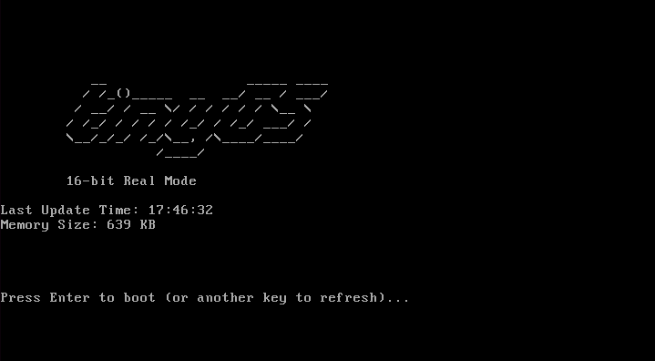
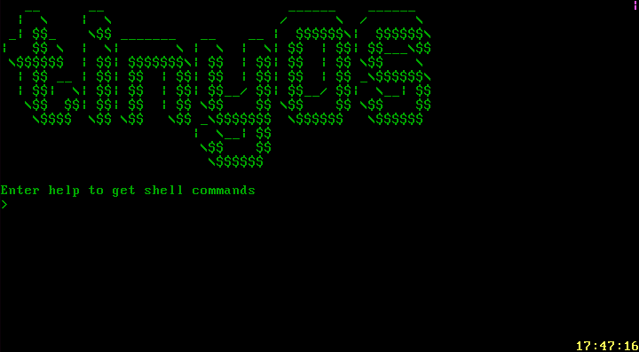

# tinyOS

A simple 64-bit operating system built from scratch for x86-64 architectures, featuring a custom bootloader, kernel, and shell.





---

## Key Features

* **Custom Bootloader**: Transitions the CPU from 16-bit real mode to 64-bit long mode.
* **Monolithic Kernel**: Includes drivers, memory management, and a scheduler.
* **Memory Management**: Paging, physical memory management (PMM), and a kernel heap (`kmalloc`/`kfree`).
* **Interrupt Handling**: Manages both CPU exceptions and hardware interrupts (IRQs).
* **Drivers**: Supports VGA text mode, keyboard, RTC, and serial communication.
* **Simple Scheduler**: A round-robin scheduler for cooperative multitasking (The kernel runs a real-time clock task in the bottom right of the screen and a rotation animation task in the top right).
* **Interactive Shell**: A basic command-line interface with commands like `help`, `time`, and `memorymap`.

---

## Getting Started

### Prerequisites

* **NASM** (Assembler)
* **Clang** (C Compiler)
* **lld** (Linker)
* **QEMU** (Emulator)

### Building the OS

To build the operating system, run the `build.sh` script. This will compile the bootloader and kernel and create a disk image named `tinyos.img`.

```bash
./build.sh
```

### Running the OS

To run the OS in QEMU, use the `run.sh` script.

```bash
./run.sh
```

This will launch QEMU with the tinyos.img disk image, and the serial port output will be redirected to your terminal.

### Project Structure
The project is organized into two main parts: the bootloader and the kernel.

```
.
├── bootloader/       # 16, 32, and 64-bit assembly code for booting
├── kernel/           # C and assembly source for the 64-bit kernel
│   ├── inc/          # Header files for the kernel
│   └── src/          # Source files for the kernel
├── build.sh          # Build script
├── run.sh            # Script to run the OS in QEMU
└── linker.ld         # Linker script for memory layout
```

bootloader/: Contains all the assembly code responsible for the initial boot process, including switching to 64-bit long mode and loading the kernel.

kernel/: Contains the C and assembly source code for the main operating system kernel, including all drivers and core functionalities.